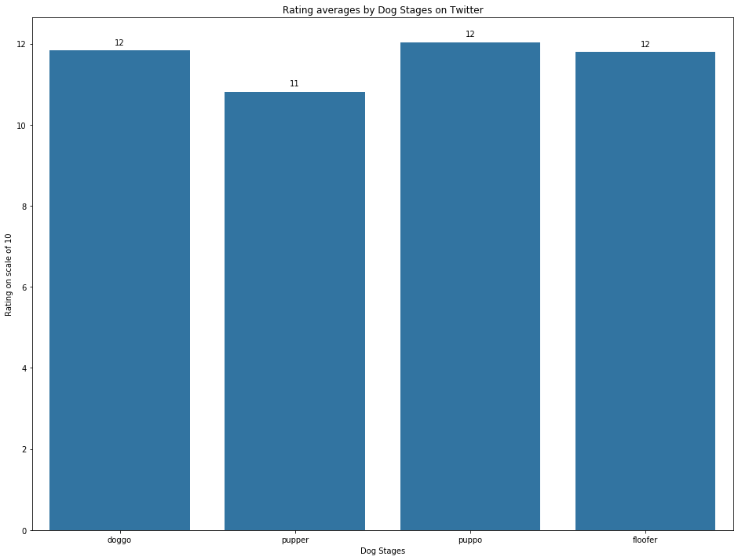

# Exploratory Data Analysis
## Introduction ##
-----
 This project steps through Exploratory Data Analysis with a goal to find interesting and trustworthy analyses and visualizations. It begins with gathering data from a variety of sources and in a variety of formats, assess its quality and tidiness, then clean it.

The dataset that will be wrangling (and analyzing and visualizing) is the tweet archive of Twitter user @dog_rates.

## Language and Packages 
-----
[Python](https://www.python.org/)
 
[NumPy](https://numpy.org/)
 
[requests](https://requests.readthedocs.io/en/master/)
 
[tweepy](https://www.tweepy.org/)
 
[json](https://docs.python.org/3/library/json.html)

## Key techniques used 
-----
- Data Gathering (from multiple sources).
- Data Assessment
- Data Cleaning
- Data Insights

## Conclusions 
----

The analysis primarily focused on impression and engagement aspects of our dog tweets as we are primarily focused on dog ratings.

Bar charts were used to visualize the average impression and engagement metrics. Below were our findings from the visualizations.

**Favorites by Dog Stages**

**Retweets by Dog Stages**

**Average Ratings by Dog Stages**

 
puppo dog stage was highly favored on average by 21,631.
Again puppo dog stage was highly retweeted on average by 6292.

All three dog stages doggo, puppo, floofer were equally rated on average at 12. While pupper was only off by 1 rating.

